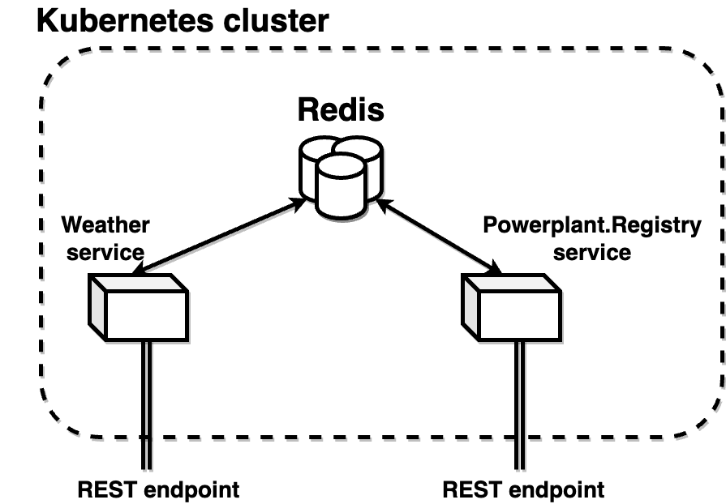
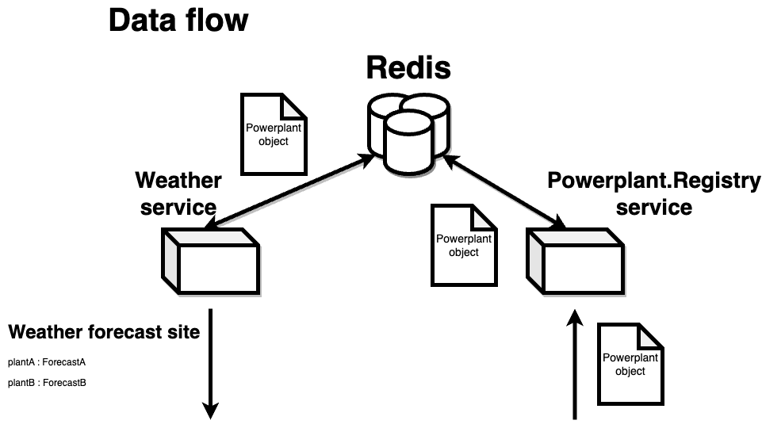

# Microservices

This is an example project to try the microservice architecture.

## Domain

Project is about weather forecast retrieval from different power plant energy production sites. Main functionality is the ability to add powerplant sites and retrieve weather forecast for them.

## Architecture diagram


Basic idea is that HA (high availability) backing resource database (Redis) is running in the background. It is used by the microservices to store data. Microservices are running in the foreground and they are the only ones that can access the database. Microservices are also the only ones that can be accessed from outside the cluster.

## System data flow


2 elemental models exist. 
1. Powerplant model (matches "powerplant id" to the "internal id")
2. Weather model (matches "powerplant id" to the "weather forecast")


## Development
The cluster deployment is considered as the Production deployment. Otherwise the development is done locally.
Repository. CI/CD pipeline is set for GitLab repository with the following stages:
- Build
- Test
- Create (artifacts)

Whole project is managed by Gradle. Gradle is used to build the project and to run the tests. Gradle is also used to create the Docker images.

## Weather service
- Offers weather forecast endpoint
- Spring application
- Deployment file: _deployments/prod/weather-deployment.yml_
- Configuration file: _deployments/prod/redis-env-configmap.yml_

## Powerplant.registry service
- Offers REST endpoint for power plant sites
- Operations:
  - Add power plant site
  - Remove power plant site
  - List power plant site
- Deployment file: _deployments/prod/powerplant-registry-deployment.yml_
- Configuration file: _deployments/prod/redis-env-configmap.yml_

## Redis cluster
- Backing resource for the microservices
- Deployed as High Availability resource to retain the data information

## Repository
- Codebase
  - common - extracted logic shared across the microservices
  - services - microservice modules
- Deployments
  - deployment
    - Kubernetes prod deployment files
    - Redis Helm chart

## How to deploy
Through Kubectl deployment files
```shell
cd deployments
kubectl apply -f prod --recursive
```

Through Helm deployment files
```shell
cd deployments
helm upgrade redis bitnami/redis -f redis-helm.yml
```

Local developmet
